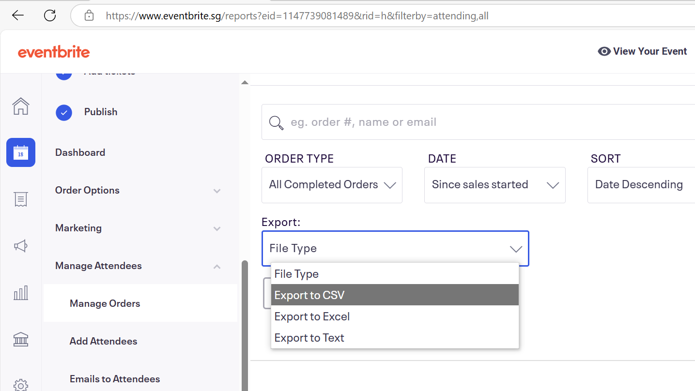

# eventbrite_automation
 automating some processes when using eventbrite

## First-time setup 
If this is the first time trying to run this on the computer, some setup is required: 

1. Install a Python 3 version (including pip, which should install with it by default). This can be done from python's website: [https://www.python.org/downloads](https://www.python.org/downloads/)

2. Open a terminal ("terminal" on MacOS, "cmd" on windows), and open it to the folder of this repository, and type in ```pip install -r requirements.txt``` 

3. First-time setup is complete! 


## Sending messages to verify attendance 
File involved: send_verification_message.py 

Running this Python file will send verification message to those who have registered for an event, but some setup is needed. This will, by default, try to send a whatsapp message, and if that fails, sends an email instead. 
Below are the setup instructions: 

1. from eventbrite, export order data to csv, as shown in this image: 

   

2. place "wa_access_token.txt" and "wa_phone_number_id.txt" in the same folder as "end_verificaion_message.py". These are files containing sensitive information about the whatsapp account used to send messages. 

3. In the web app (streamlit run csv_streamlit_app.py), upload your order data csv file, fill in the required fields and press send. 

4. some more setup is needed for emailing, but it's not implemented yet, so further instructions will be added later 


## Automatically checking replies about verification of attendance 
This feature has not been implemented yet :( more details later 


## Re-sending messages to try verifying attendance again 
Not implemented yet 


